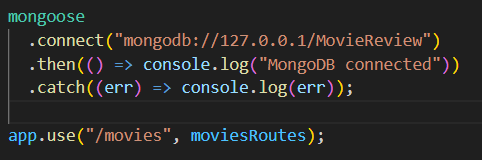
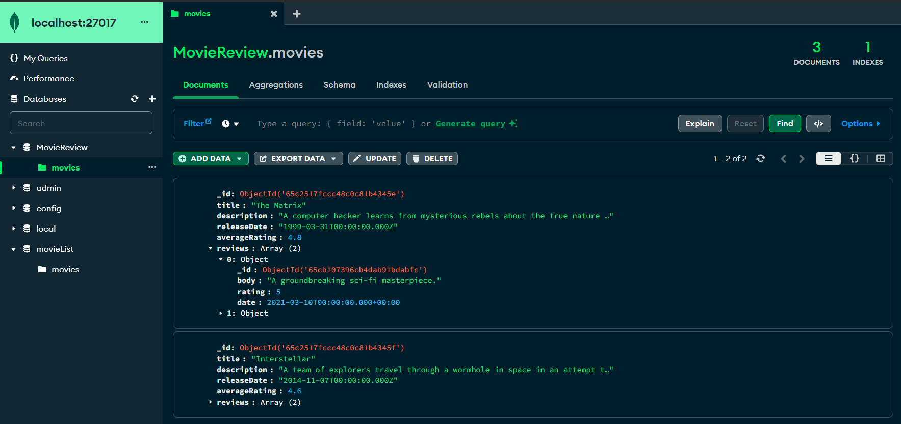

# Movie Review Application

## Overview
This application is a full-stack MERN project that allows users to add, edit, delete, and review movies. The frontend is built with React.js and styled with CSS, while the backend is powered by Node.js with an Express.js framework, connecting to a MongoDB database.

## Features
- List movies
- Add new movies
- Edit existing movies
- Delete movies
- Write reviews for movies
- Delete reviews
- View all reviews for a specific movie

## Tech Stack
- **Frontend**: React.js
- **Backend**: Node.js, Express.js
- **Database**: MongoDB
- **Styling**: CSS

## Prerequisites
- Node.js and npm installed.
- MongoDB running locally or a MongoDB Atlas account.
- Knowledge of JavaScript, React, Node.js, and MongoDB.

## Installation & Setup

Clone the repository:
```bash
git clone https://github.com/YavuzYilmazz/movie-review-app.git
cd movie-review-app
cd movie-review-backend
```

Change the `app.js` file to include your MongoDB URI.



You need schema like this in your db:



```json
{
    "title": "Inception",
    "description": "A thief who steals corporate secrets through the use of dream-sharing technology is given the inverse task of planting an idea into the mind of a CEO.",
    "releaseDate": "2010-07-16T00:00:00.000Z",
    "averageRating": 5,
    "reviews": [
      {
        "body": "Mind-blowing and thought-provoking!",
        "rating": 5,
        "date": "2021-01-01T00:00:00.000Z"
      },
      {
        "body": "Incredible visuals and a gripping story.",
        "rating": 5,
        "date": "2021-02-15T00:00:00.000Z"
      }
    ]
  }
```


You can use List.js file to add some data to your db.


```bash
after that, run the following commands:

```bash
npm install
node app.js
```

Open a new terminal and run the following commands:

```bash
cd movie-review-frontend
npm install
npm start
```

## API Endpoints

| Method | Endpoint                         | Description                           |
|--------|----------------------------------|---------------------------------------|
| GET    | /api/movies                      | Retrieve all movies                   |
| POST   | /api/movies                      | Add a new movie                       |
| GET    | /api/movies/:id                  | Retrieve a movie by ID                |
| PUT    | /api/movies/:id                  | Update a movie by ID                  |
| DELETE | /api/movies/:id                  | Delete a movie by ID                  |
| POST   | /api/movies/:id/reviews          | Add a review to a movie               |
| DELETE | /api/movies/:id/reviews/:reviewId| Delete a review by review ID          |

## Contact
If you have any questions or need help with the setup, feel free to reach out to me at [`yavuz.yilmaz1@outlook.com`].

## Help 

You can watch this video https://www.loom.com/share/26c12333a9754dddbf6a19586b8e4af5?sid=9c262fd1-f891-4454-9f71-c7b56260636e
